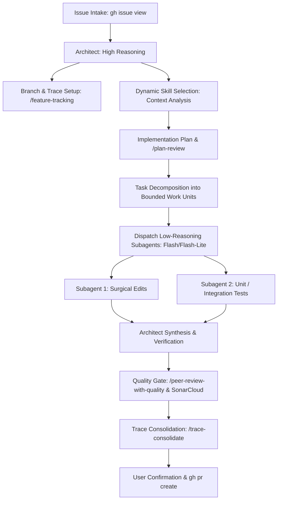

# Run Issue To PR Workflow (`/run-issue-to-pr`)

Autonomous orchestration workflow that transforms a GitHub issue into a verified, quality-gated Pull Request.

---

## Operating Architecture: The Architect / Subagent Pattern



### 1. High-Reasoning Architect
The primary agent acts as the **Lead Software Architect and Orchestrator**:
- Retains strategic context, architectural constraints, and git state.
- Selects domain-specific skills dynamically.
- Formulates implementation plans and runs `/plan-review`.
- Verifies all diffs, tests, and quality gates before any commit or PR creation.

### 2. Low-Reasoning Subagents
Implementation tasks are offloaded to **focused subagents** (using `flash` or `flash_lite` model tier):
- Assigned bounded, single-file or single-component objectives.
- Provided explicit file paths, replacement blocks, and test verification commands.
- Report completion directly back to the Architect without polluting parent context.

---

## Systematic Execution Stages

### Stage 1: Intake & Trace Setup
1. **Fetch Issue Context:**
   ```powershell
   gh issue view <issue-id> --json title,body,labels,assignees,milestone
   ```
2. **Create Prefixed Branch:** Name branch using conventional prefix: `feat/<issue-id>-<slug>`, `fix/<issue-id>-<slug>`, or `chore/<issue-id>-<slug>`.
   ```powershell
   git checkout -b feat/<issue-id>-<slug>
   ```
3. **Initialize Feature Work Trace:**
   Create `/docs/traces/[branch-name]-work-trace.md` per `/feature-tracking`. Populate Section 1 (Planned Work) with TODOs, target files, and rationale.

### Stage 2: Dynamic Skill Selection & Plan Review
Analyze the issue requirements and dynamically activate the relevant specialized skills from the catalog:

| Domain Detected | Activated Skill | Focus / Invariants |
|---|---|---|
| Non-trivial state / logic / risk | `/doubt-driven-development-slim` | 5-step adversarial evaluation cycle |
| UI, styling, components | `/frontend-ui-engineering-slim` | Modularity, touch targets, no `!important`, no inline styles |
| Endpoints, DTOs, contracts | `/api-and-interface-design-slim` | RFC 7807 problem details, idempotency, backward compatibility |
| Schema, queries, migrations | `/database-and-migrations-slim` | Zero-downtime expand/contract, safe indexing, pool protection |
| Auth, user input, external APIs | `/security-and-hardening-slim` | OWASP Top 10, parameterized queries, secret hygiene |
| Performance, rendering, CWV | `/longest-contentful-paint-slim` | LCP < 2.5s, TTFB < 800ms, fetchpriority |
| Regression, complex bug | `/debugging-and-error-recovery-slim` | Scientific reproduction, falsifiable hypotheses |
| Business rules, algorithms | `/test-driven-development-slim` | Red-Green-Refactor, boundary mocking |
| Modals, forms, navigation | `/accessibility-and-a11y-slim` | Semantic HTML, keyboard traps, WCAG contrast >= 4.5:1 |
| CI/CD, actions, releases | `/ci-cd-and-automation-slim` | Non-interactive invariants, reusable actions, SemVer |

Draft the implementation plan incorporating the active skills' invariants. Audit and verify the plan using `/plan-review`.

### Stage 3: Subagent Execution & Implementation
1. Decompose the plan into independent implementation chunks.
2. Follow `/subagent-delegate-on-rails` for metacognitive decomposition, heuristic model tier selection (`flash` / `flash_lite`), and anti-chatter prompt rails.
3. Dispatch focused subagents (`Implementer`, `TestEngineer`, etc.) with Artifact + Contract only.
4. The Architect verifies and reconciles subagent output against the plan using doubt-driven classification.

### Stage 4: Verification & Quality Review Gate
1. **Automated Testing:** Run test suites via `/testing-workflow` (100% pass rate required).
2. **Quality Gate Review:** Execute the upgraded `/peer-review-with-quality` workflow:
   - Audit surgical git diffs (`git diff`).
   - Run linter/compiler checks.
   - Verify SonarCloud quality gate compliance (0 new blocker/critical issues).
   - Execute specialized quality checks from dynamically selected skills (e.g. accessibility audit, security checklist).

### Stage 5: Trace Finalization & PR Creation
1. **Consolidate Trace:** Run `/trace-consolidate` on `/docs/traces/[branch-name]-work-trace.md`.
2. **User Confirmation:** Confirm with the user before committing:
   > *"All verification and quality gates have passed. Ready to commit and create PR for Issue #<id>?"*
3. **Commit & PR Submission:**
   - Commit changes using Conventional Commits and Imperative Tense:
     ```powershell
     git commit -am "feat: implement <feature-summary> (#<issue-id>)"
     ```
   - Push branch and create Pull Request linking the issue and trace:
     ```powershell
     git push -u origin <branch-name>
     gh pr create --title "feat: <feature-title> (#<issue-id>)" --body "Closes #<issue-id>`n`nTrace: [docs/traces/<branch-name>-work-trace.md]"
     ```
